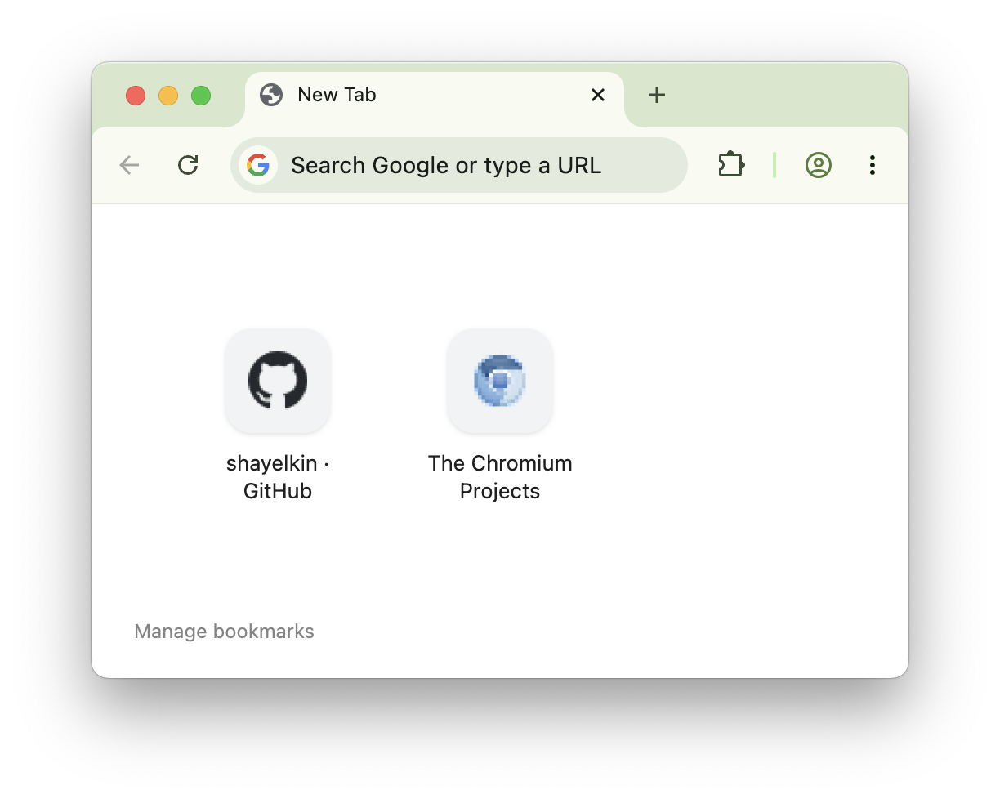

# newtab-with-bookmarks

A New Tab page for Chrome that displays the Bookmarks Bar's bookmarks, similar to Safari's default
new tab page.

## Install

This extension is not published to the Chrome Web Store, and need to be installed as an unpacked
extension:

1. Clone this repository, or download the latest [release](../../releases/latest) and unzip it to a
   permanent location.
2. Navigate to Chrome's extensions configuration (`chrome://extensions`), and enable developer mode
   (top-right toggle).
3. Click **Load unpacked** and select the location you placed the extension code in.

## License

This software is licensed under the terms of the [MIT license](LICENSE).
